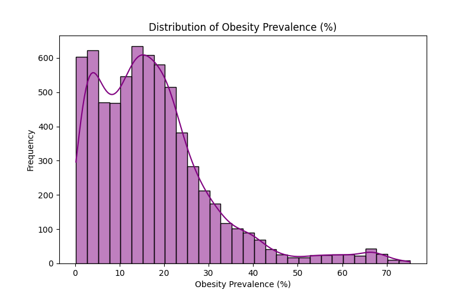

# Global Obesity Trends Analysis (1990–2022)

--------------------------------------------

## Overview
This project analyzes **global adult obesity prevalence** using WHO Global Health Observatory data.  
It includes **data cleaning, exploratory analysis, clustering (K-Means), forecasting (Linear Regression)** and a **Power BI dashboard** for interactive insights.

Key Features:
- Global obesity trend analysis (1990–2022)
- Top/Bottom 10 countries by prevalence
- Country clustering into risk groups
- Forecasting trends for 2023–2027
- Interactive Power BI dashboard with slicers & filters

-----------------------------------------------

## Dataset
- **Source:** WHO Global Health Observatory (GHO)
- **File Used:** `obesity-prevalence-adults-who-gho.csv`
- **Columns:**
  - `Entity` – Country
  - `Year` – 1990–2022
  - `Obesity_Prevalence` – Adult obesity prevalence (%)

--------------------------------------------------

## Methodology

### 1. Data Cleaning
- Dropped missing values and unnecessary columns
- Renamed columns for clarity (`Obesity_Prevalence`)
- Converted Year to integer
- Saved cleaned dataset as `cleaned_obesity_data.csv`

**Cleaning Code:**


**Cleaning Observations:**


---

### 2. Exploratory Data Analysis (EDA)
- Generated descriptive statistics
- Visualized:
  - Global trend over time
  - Top 10 and bottom 10 countries (latest year)
  - Distribution histogram

**EDA Code:**


**Trend Chart:**


**Top 10 Countries (Latest Year):**


**Bottom 10 Countries (Latest Year):**


**EDA Observations:**


---

### 3. Clustering (Machine Learning)
- Applied **K-Means (k=3)** to average obesity prevalence by country
- Segmented into Low, Medium, High prevalence clusters
- Evaluated with Silhouette Score

**ML Code:**


**Cluster Plot:**


**ML Observations:**


---

### 4. Forecasting (Innovation)
- Used **Linear Regression** to forecast global average obesity prevalence for 2023–2027
- Predicted continued rise in obesity rates

**Forecasting Code:**
.PNG)

**Forecast Chart:**


**Forecast Observations:**
.PNG)

---

### 5. Power BI Dashboard
- Imported cleaned and clustered datasets
- Created visuals:
  - Line chart: Global obesity trend
  - Bar charts: Top/Bottom 10 countries
  - Donut chart: Clusters
- Added slicers for **Year** and **Country**

**Dashboard Screenshot:**


---

## Project Structure

---

## How to Run

### 1. Clone the Repository
```bash
git clone https://github.com/<your-username>/ObesityAnalysis.git
cd ObesityAnalysis
python -m venv .venv
.venv\Scripts\activate   # Windows
pip install pandas numpy matplotlib seaborn scikit-learn
python obesity_analysis.py
Results Summary
Obesity prevalence increased steadily worldwide (1990–2022)

Top 10 countries exceed 30% prevalence, bottom 10 <5%

Clustering shows three clear risk levels (Low/Medium/High)

Forecast indicates rising trend through 2027

Recommendations
High-risk countries: Aggressive policy interventions (diet, activity)

Medium-risk: Preventive education campaigns

Global: Collaborative strategies via WHO & governments

Future Work
Correlate obesity with GDP, urbanization, and lifestyle factors

Apply advanced forecasting (ARIMA/Prophet)

Expand dashboard with AI visuals & drill-through analytics

Author
Willy Hirwa
Big Data Analytics – AUCA


